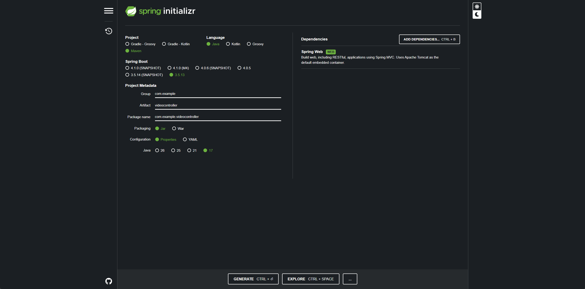
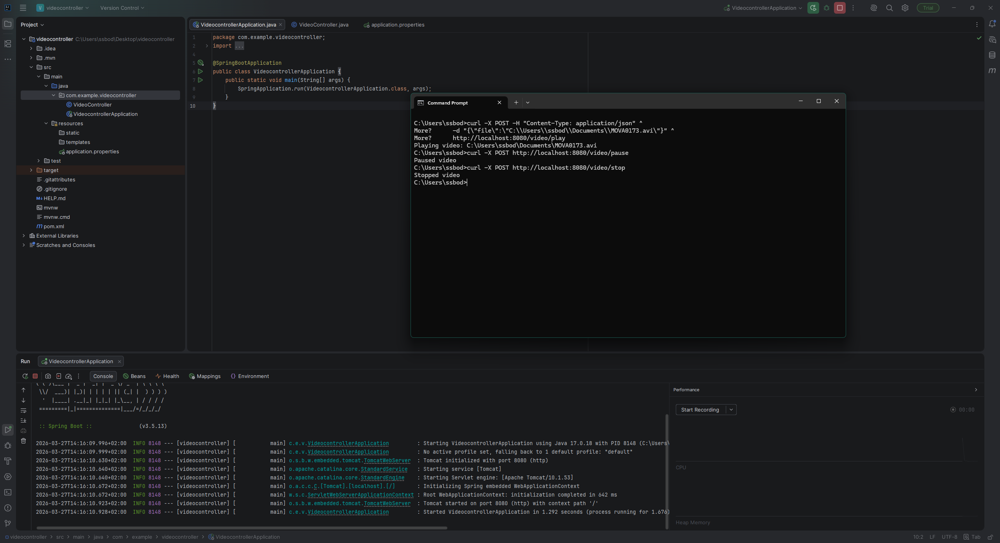

# Video Controller Service

A simple Java Spring Boot service to **control video playback** on a local machine using **VLC media player**. Designed as a prototype for automated test scenarios.

---

## Project Setup

- Created using [Spring Initializr](https://start.spring.io)  
  - **Project:** Maven, **Java 17**, **Spring Boot 3.5.13**  
  - **Dependencies:** Spring Web  
  - **Package:** `com.example.videocontroller`
- Opened in **IntelliJ Community Edition** and run **Spring Boot** from the IDE  
- **VLC Media Player** used for video playback  
- Windows environment  
- JSON input used for file paths to avoid encoding issues  

**Screenshots of Setup:**

**Spring Initializr settings:**  


**Running in IntelliJ IDE:**  


---

## Project Files

- `src/main/java/com/example/videocontroller/VideocontrollerApplication.java` — Spring Boot entry point  
- `src/main/java/com/example/videocontroller/VideoController.java` — handles REST endpoints and VLC commands  
- `src/main/resources/application.properties` — configuration for VLC path and RC port  
- `pom.xml` — Maven dependencies for Spring Boot  

---

## How it Works

- `VideoController.java` exposes **3 REST endpoints**:  
  - `POST /video/play` — starts a video from JSON input:  
    ```json
    {"file": "C:\\Path\\To\\Your\\VideoFile.avi"}
    ```  
  - `POST /video/pause` — pauses the currently playing video  
  - `POST /video/stop` — stops playback and closes VLC  

- **VLC RC interface** is used to send pause/stop commands via TCP (`vlc.rc-port=9999`)  
- Spring Boot server runs on **port 8080**  
- The main application class `VideocontrollerApplication.java` starts the Spring Boot server  

---

## Running the Project

- Start Spring Boot from **IntelliJ IDE** (run `VideocontrollerApplication.java`)  
- Keep the terminal open and ready for REST calls  

### Test Endpoints Using CMD

Run the following commands sequentially in **one Command Prompt session** to demo **play → pause → stop**:

```cmd
REM Play video
curl -X POST -H "Content-Type: application/json" ^
     -d "{\"file\":\"C:\\Path\\To\\Your\\VideoFile.avi\"}" ^
     http://localhost:8080/video/play

REM Pause video
curl -X POST -H "Content-Type: application/json" ^
     http://localhost:8080/video/pause

REM Stop video
curl -X POST -H "Content-Type: application/json" ^
     http://localhost:8080/video/stop
